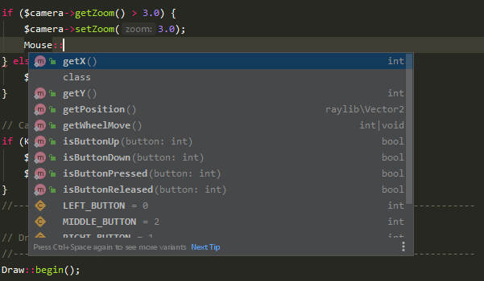

# raylib-php

PHP 7.x bindings for RayLib, a simple and easy-to-use library to learn video games programming (www.raylib.com)

This is currently a work-in-progress and bindings are not complete and are likely to change. Progress of binding can be tracked via
[MAPPING.md](MAPPING.md)

 - raylib.h - 141 of 426 functions ~ %33 complete
 - raymath.h - TODO Extra mathy stuff
 - raygui.h - TODO API for drawing GUI
 - physac.h - TODO More complex collision detection, more than built-in collision detection

## Isn't PHP A Terrible Choice For Games?

Here are some common misconceptions:

 - **PHP has no multi-threading**. There are native PHP extensions to enable this, pThreads and now a easier way to tackle this issue Parallel - https://github.com/krakjoe/parallel
 - **PHP is too slow**. Since PHP 7 a lot of things have gotten faster, so it can out perform Python and NodeJS in some area. PHP 8 will include a JIT which should provide even more performance, ETA of PHP is around December of 2020.
 - **Object Oriented Programming in PHP is horrible**. Since PHP 5.4+ you get a lot of feature parity and since PHP 7 you now get type checking.
 - **Garbage Collection IS ... GARBAGE** - Until PHP 7.3 this was true. Running PHP in a tight loop for hours/days on end would hit a point where PHP could spend more time doing GC than anything else. This has been greatly improved.

## Example


```php
<?php

use raylib\Color;
use raylib\Draw;
use raylib\Text;
use raylib\Timming;
use raylib\Window;

// Initialization
//--------------------------------------------------------------------------------------
$screenWidth  = 800;
$screenHeight = 450;
$lightGray    = new Color(245, 245, 245, 255);
$gray         = new Color(200, 200, 200, 255);

Window::init($screenWidth, $screenHeight, "raylib [core] example - basic window");

Timming::setTargetFps(60);
//--------------------------------------------------------------------------------------

// Main game loop
while (!Window::shouldClose())    // Detect window close button or ESC key
{
    // Update
    //----------------------------------------------------------------------------------
    // TODO: Update your variables here
    //----------------------------------------------------------------------------------

    // Draw
    //----------------------------------------------------------------------------------
    Draw::begin();

    Draw::clearBackground($lightGray);

    Text::draw("Congrats! You created your first window!", 190, 200, 20, $gray);

    Draw::end();
    //----------------------------------------------------------------------------------
}

// De-Initialization
//--------------------------------------------------------------------------------------
Window::close();        // Close window and OpenGL context
//--------------------------------------------------------------------------------------
```

## Autocomplete

In this branch there is a [stub](./stub) directory is that contains all the classes and methods so you get information on everything and anything implemented.



## License

raylib-php is licensed under an unmodified zlib/libpng license, which is an OSI-certified, 
BSD-like license that allows static linking with closed source software. Check [LICENSE](LICENSE) for further details.
	
*Copyright (c) 2017 Joseph Montanez ([@joseph-montanez](https://twitter.com/shabb_jm))*

## Binary Releases

[Windows PHP Extension DLL](https://github.com/joseph-montanez/raylib-php/releases)

## API Differences

RayLib is a library designed for procedural code. All functions live in a global scope. While I could and still can do this, I'd prefer to organize and namespace the API.

For example instead of calling `CheckCollisionPointTriangle()`, in PHP you'd call `raylib\Collision::checkPointTriangle()`. That static class method could technically live as a scoped function instead for example `raylib\Collision\checkPointTriangle` however this could become make importing far more tedious. 

If this becomes a bigger problem, I can create a procedural API compatibility later to better align to RayLib's C-API.

## API Limitation

The PHP RayLib implementation has two glaring limitations.

 - Not all object properties are read and write, for example `/raylib/Image::width` is a read-only property but `/raylib/Vector2::x` is a read/write properties. When you want to alter a property that is read-only there should be method calls such as `/raylib/Image::resize()` that will adjust the properties for you.
 - All RayLib object assignment i.e `$player->position = $position` will **not copy** the variable but instead **link** the property. So if you want to copy the data instead, you need to use PHP's clone feature `clone` i.e `$player->position = clone $position`.

## How To Build PHP Extension

Windows is by far the hardest platform to support and build for. Please use the binaries for Windows instead unless you want to commit fixes to this repo.

### MacOS & Linux

#### Ubuntu 19.10

    sudo apt-get install -y libx11-dev xorg-dev

#### Build

    phpize
    ./configure
    make

### Windows

Windows requires compiling with PHP sources (Currently Visual Studio 2017 needed), you will still get a .dll in the end.

You will need to also compile RayLib as well. At the time writing I am using Visual Studio 2017 compiler, since PHP 7.4 requires this. Once compiled paste the following files:

(Please note your Raylib and PHP paths may be different)

**Static Libs**

    C:\src\raylib-2.6.0\cmake-build-debug\src\external\glfw\src\glfw3.lib -> C:\php-sdk\phpmaster\vc15\x64\deps\lib\raylib\glfw3.lib
    C:\src\raylib-2.6.0\cmake-build-debug\src\raylib_static.lib -> C:\php-sdk\phpmaster\vc15\x64\deps\lib\raylib\raylib_static.lib

**GLFW Includes**

    C:\src\raylib-2.6.0\cmake-build-debug\src\external\glfw\src\glfw_config.h -> C:\php-sdk\phpmaster\vc15\x64\deps\include\GLFW\glfw_config.h
    C:\src\raylib-2.6.0\src\external\glfw\include\GLFW\glfw3.h -> C:\php-sdk\phpmaster\vc15\x64\deps\include\GLFW\glfw3.h
    C:\src\raylib-2.6.0\src\external\glfw\include\GLFW\glfw3native.h -> C:\php-sdk\phpmaster\vc15\x64\deps\include\GLFW\glfw3native.h

**RayLib Includes**

    C:\src\raylib-2.6.0\cmake-build-debug\src\raudio.h -> C:\php-sdk\phpmaster\vc15\x64\deps\include\raudio.h
    C:\src\raylib-2.6.0\cmake-build-debug\src\raylib.h -> C:\php-sdk\phpmaster\vc15\x64\deps\include\raylib.h
    C:\src\raylib-2.6.0\cmake-build-debug\src\raymath.h -> C:\php-sdk\phpmaster\vc15\x64\deps\include\raymath.h
    C:\src\raylib-2.6.0\cmake-build-debug\src\rlgl.h -> C:\php-sdk\phpmaster\vc15\x64\deps\include\rlgl.h

Once you have PHP & Raylib setup you can then compile the extension

    %comspec% /k "C:\Program Files (x86)\Microsoft Visual Studio\2017\BuildTools\VC\Auxiliary\Build\vcvars64.bat"
    cd C:/php-sdk
    phpsdk-vs16-x64.bat
    cd phpmaster\vc15\x64\php-src
    cls && buildconf --force && configure --disable-all --enable-cli --with-raylib && nmake

## How To Run raylib PHP Extension

### MacOS & Linux

    php -dextension=modules/raylib.so examples/textures/textures_image_loading.php

### Windows

    php.exe -dextension=modules/php7raylib-2.0.0-dev.dll examples/textures/textures_image_loading.php